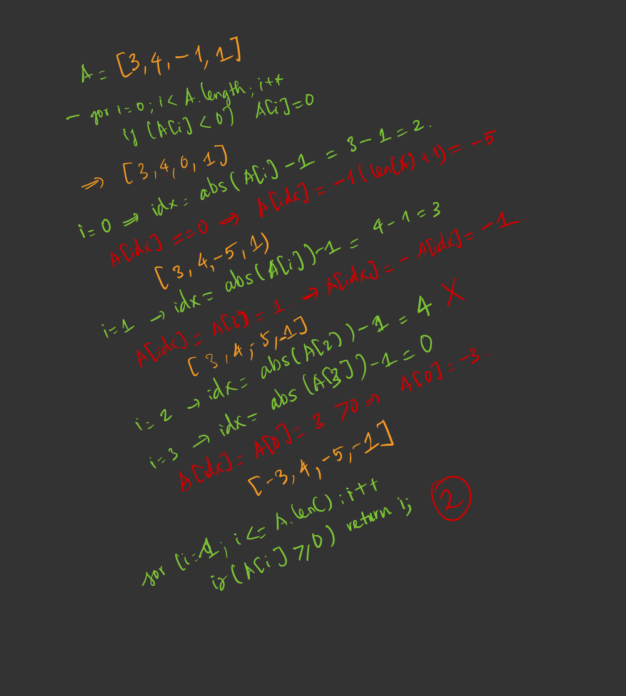

- [Refer](https://www.youtube.com/watch?v=8g78yfzMlao)

- We can easily solve this problem in O(n) time complexity, with O(n) memory space by using `HashSet`. So how to solve this by just using O(1) memory?
- Just **using the input array as extra memory**

